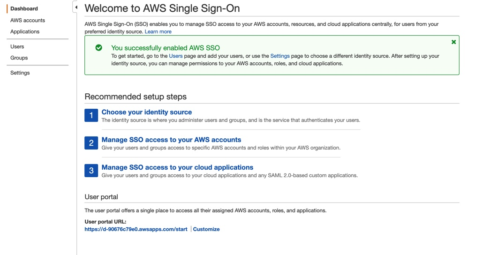

# SSO

Single Sign-On (SSO) allows you to manage a single pool of users with access to
multiple AWS accounts from a single pane of glass.

It is best to run the SSO configuration manually, after deploying the
`bin/organizations` stack. It only needs to be done once.

## Activate AWS SSO

From the management consolog go the `AWS SSO` service and click on `Enable AWS
SSO`.


After a few minutes the service will be on, and it will redirect us to a new
page:



## Permission Sets

A permission set is a collection of administrator-defined policies that AWS SSO
uses to determine a user's access to a given AWS account. We are going to create
the following permission sets:

- **AdministratorAccess**: Grants administrator access to an account.
- **DeveloperAccess**: Grants permission over resources but not over users or groups.
- **DevOpsAccess**: Grants permissions to manage CI/CD pipelines through CDK.
- **ApproverAccess**: Grants permissions to view and approve manual changes to
  pipelines.
- **ViewOnlyAccess**: Grants readonly permissions over resources.
- **BillingAccess**: Grants permissions over billing information.

### Procedure

On the SSO Management page go to `AWS accounts`. Click on the `Permission sets`
tab and click on the `Create permission set` button.

Select `Use an existing job function policy` and click `Next: Details`. We will
configure the job function corresponding to each of the permission sets we want
to create. Use the following table configure each permission set accordingly.

| Permission Set | Job function policies |
| --- | --- |
| `AdministratorAccess` | `AdministratorAccess` |
| `BillingAccess` | `Billing` |
| `ViewOnlyAccess` | `ViewOnlyAccess` |

Then complete the wizard.

For the `DeveloperAccess` and `DevOpsAccess` follow the same procedure but
select `Create a custom permission set`. Here are the configuration for each
permission set:

- `DeveloperAccess`:
  - `Name`: DeveloperAccess
  - `Attach AWS managed policies`: checked
    - `AWS Managed policies`:
      - `PowerUserAccess`
  - `Create a custome permission policy`: checked
    - ```json
      {
        "Version": "2012-10-17",
        "Statement": [
            {
                "Action": [
                    "iam:CreateRole",
                    "iam:DeleteRole",
                    "iam:GetRole",
                    "iam:PassRole",
                    "iam:UpdateRole",
                    "iam:AttachRolePolicy",
                    "iam:DetachRolePolicy",
                    "iam:PutRolePolicy",
                    "iam:DeleteRolePolicy"
                ],
                "Effect": "Allow",
                "Resource": "*"
            }
        ]
      }
      ```
- `DevOpsAccess`:
  - `Name`: DevOpsAccess
  - `Attach AWS managed policies`: checked
    - `AWS Managed policies`:
      - `AWSCloudFormationFullAccess`
      - `AWSCodeBuildAdminAccess`
      - `AWSCodePipeline_FullAccess`
      - `AmazonS3FullAccess`
      - `AmazonEC2ContainerRegistryFullAccess`
      - `SecretsManagerReadWrite`
  - `Create a custome permission policy`: checked
    - ```json
      {
        "Version": "2012-10-17",
        "Statement": [
            {
                "Action": [
                    "iam:CreateRole",
                    "iam:DeleteRole",
                    "iam:GetRole",
                    "iam:PassRole",
                    "iam:AttachRolePolicy",
                    "iam:DetachRolePolicy",
                    "iam:PutRolePolicy",
                    "iam:GetRolePolicy",
                    "iam:DeleteRolepolicy",
                    "kms:CreateKey",
                    "kms:PutKeyPolicy",
                    "kms:DescribeKey",
                    "kms:CreateAlias",
                    "kms:DeleteAlias",
                    "kms:ScheduleKeyDeletion",
                    "organizations:ListAccounts",
                    "organizations:ListTagsForResource"
                ],
                "Effect": "Allow",
                "Resource": "*"
            },
            {
                "Action": [
                    "sts:AssumeRole"
                ],
                "Effect": "Allow",
                "Resource": "arn:aws:iam::*:role/cdk*"
            }
        ]
      }
      ```
- `ApproverAccess`:
  - `Name`: ApproverAccess
  - `Attach AWS managed policies`: checked
    - `AWS Managed policies`:
      - `AWSCodePipelineApproverAccess`

Each of this permission sets should be added to individual groups.

| Permission Set | Group |
| --- | --- |
| `AdministratorAccess` | `Administrators` |
| `DeveloperAccess` | `Developers` |
| `DevOpsAccess` | `DevOps` |
| `BillingAccess` | `Billing` |
| `ViewOnlyAccess` | `ViewOnly` |
| `ApproversAccess` | `Approvers` |

You can create them at the `Groups` section inside the Amazon SSO Management
Console.

To attach the permission sets to each group navigate to the `AWS Accounts`
section of the AWS SSO Management Console. Select all the accounts and click
`Add Users`. Map the appropiate group with its permission set using the wizard.

> It might take a few minutes for the permission sets to propagate throughout
> the accounts.

Click `Proceed to AWS accounts` once its done.

It is important that:

1. `Developers` have only `DeveloperAccess` on the `Dev` account.
2. `DevOps` have only `DevOpsAccess` to the `CICD` account.
3. `Approvers` have only `ApproverAccess` to the `CICD` account.

On the remaing accounts the users could be given `ViewOnly` access or none.

Now you can create users and assign them to its appropiate group. A few minutes
after each user is created, an email is sent to them with information regarding
how to connect thorugh SSO.

### Customizing user portal URL

On the welcome email, each user will receive the URL they need to access their
account. By default, it isn't a friendly URL. we can fix that by clicking
`Customize` under the `User portal` section of the Amazon SSO Management Console
page.


